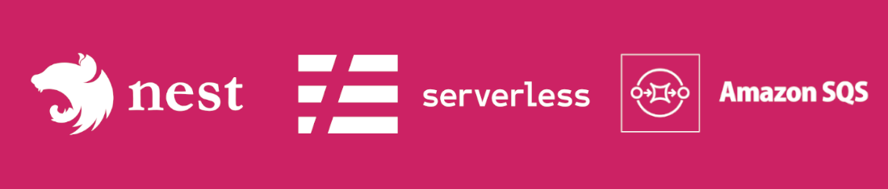

# Serveless Framework and Amazon SQS

## Technology Stack

- **Monorepo**: This is a [monorepo](https://docs.nestjs.com/cli/monorepo#monorepo-mode) containing multiple Lambda functions and shared infrastructure
- **AWS SQS**: The `consumer` function is a standalone NestJS application that receives and process SQS messages
- **REST API**: The `producer` function is built using REST APIs to send SQS messages
- **NestJS**: Uses [NestJS framework](https://docs.nestjs.com/) for building scalable server-side application
- **Cloud-Native Architecture**: Built using cloud-native patterns and best practices to maximize the benefits of the cloud infrastructure, such as scalability and high availability
- **Serverless Framework**: Deployed using the [Serverless Framework](https://www.serverless.com/) for easy management of serverless applications
- **AWS Lambda**: Used for serverless function execution, where business logic is run in response to events
- **AWS API Gateway**: Used to create and manage APIs, providing endpoints for client applications to interact with the functions
- **Infrastructure as Code (IaC)**: Manages shared infrastructure using [Terraform](https://www.terraform.io/)

## Deployment flow

See details as [how to deploy](docs/markdown/how-to-deploy.md) in the deployment documentation.

## General organization

## Documentation about

- [How to contribute](./CONTRIBUTING.md)
- [How to deploy](docs/markdown/how-to-deploy.md)
